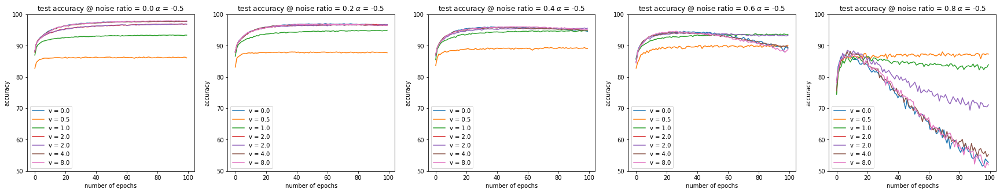
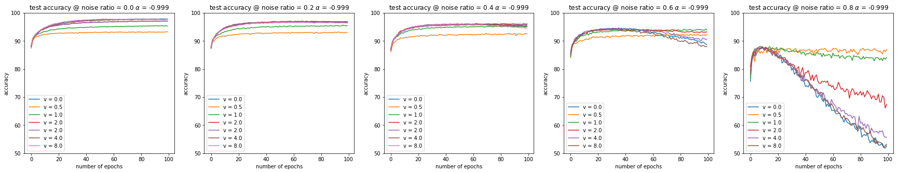
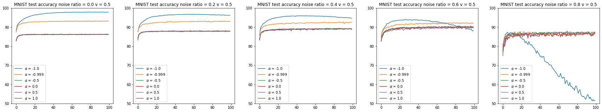
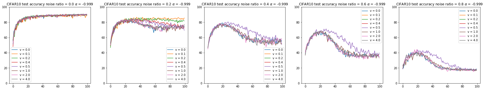
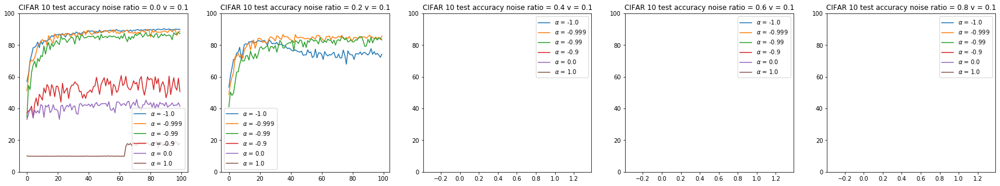

# Volumization
Evaluate another simple regularization approach into benchmarks

## Important points
- double momentum discount to keep the momentum in the right direction

presentation hyperparameters: 
- alpha in [1 0.9999 0.99 0.5 0 -0.5 -1]
- v in [0 0.1 0.2 0.5 1 2 4]

## Experiment plan
### 1. MNIST + 2 layer NN - Finished
alpha in [-1, -0.999, -0.5, 0, 0.5]
v in [0.5 1 2 4 8]

fix alpha=-0.5, observe the effect of v

- smaller alpha is robust to the label noise 
- while limiting the capability of the networks

fix v=0.5, observe the effect of alpha 

- alpha close to -1 has more capability 
- but also prevents overfitting even when label noise is large  

### 2. CIFAR10 +ResNet18 - In progress
fix alpha=-0.999

- v will not constrain the capability of networks when the network is complex
- 0.5 is sufficient for small 2-layer network, but 0.5 is still too large for ResNet18 to prevent overfitting

- when v is 0.1, which may produce some results that robust to noise (nr=0.2), large alpha (far from -1) may produce unexpected limitation
#### todo list

### 3. IMBD + LSTM & Attention - TBA

## Roadmap
1. CIFAR 100 evaluation
2. Adversarial Attack